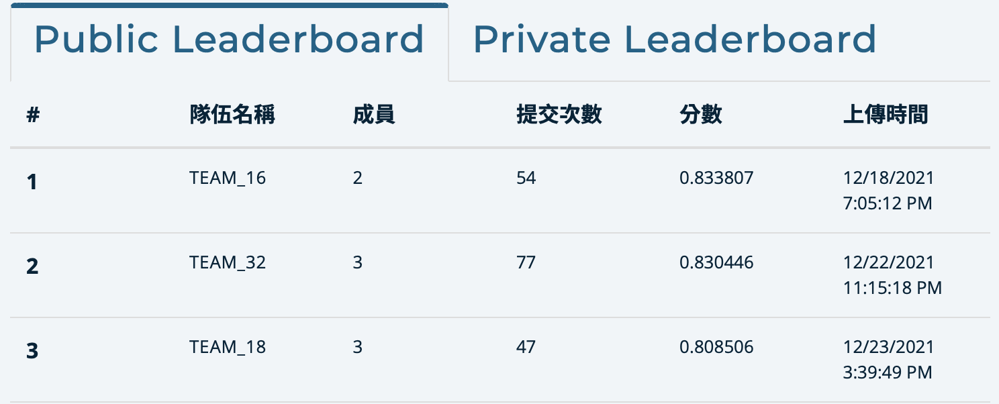
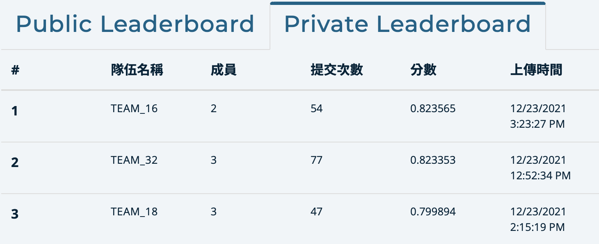

# Scene_text_detection_and_recognition
[](https://tbrain.trendmicro.com.tw/Competitions/Details/19)

T-Brain：繁體中文場景文字辨識競賽－高階賽：複雜街景之文字定位與辨識
## Rank 3 on Public and Private



# requirements
```
pip install -r requirements.txt
```

## Stage One: Detection 
#### (Remember to modify the path of file to yours. e.g. cd yolov5)
We use [yolov5](https://github.com/ultralytics/yolov5) to capture the text of the scene.

YoloV5 extracts two types of objects from the scene, the first type is Chinese character and the second type is English\Numeric string or character.

### preporcessing

Please see README.md in the yolov5/preprocessing directory

### Train 
```
python train.py --img 1365 --rect --batch 8 --epochs 300 --data data/high_level.yaml --weights yolov5x6.pt --device 0
```


### Inference

Donwload our Training weights to test on private datasets (https://drive.google.com/drive/folders/1NkuSVJcCduJ1YiDAhk2xj4yzkRxn0CWs?usp=sharing)
```
python detect.py --source datasets/high_level/images/private/ --weights runs/train/exp4/weights/best.pt --img 1408 --save-txt --save-conf  --conf-thres 0.7 --iou-thres 0.45 --augment
```

## Stage Two: Recognition 
#### (Remember to modify the path of file to yours. e.g. cd deep-text-recognition-benchmark)
We use [deep-text-recognitiom-benchmark](https://github.com/clovaai/deep-text-recognition-benchmark) to recognize the text of the detected image.

There are two models for this step, the first model is for Chinese character and the second is for English\Numeric string or character.

For the first model, we train on the training dataset of T-brain and ReCTS.

For the second model, we use the pretrained of deep-text-recognitiom-benchmark.

### Prepare the dataset 
We first crop the chinese character from T-brain images. 
```
python processing/crop_chinese_ch.py 
```
Then crop the chars from ReCTS training set.
```
python processing/crop_AE_ch.py
```
And we split the first 5000 words as validation set, the rest of wors are training set.

Here are the characters we already cropped: (https://drive.google.com/file/d/1flVnxIIRgn2akANQ1Jhix-AbFHrQpYaA/view?usp=sharing). 
Download it and put it on the root of deep-text-recognition-benchmark.

Then we create language model datasets, The output will default save at [./result] folder.
```
python create_lmdb_dataset.py --inputPath data_tbrain_and_AE/train --gtFile data_tbrain_and_AE/train/gt.txt --outputPath result/data_tbrain_and_AE/train
python create_lmdb_dataset.py --inputPath data_tbrain_and_AE/val --gtFile data_tbrain_and_AE/val/gt.txt --outputPath result/data_tbrain_and_AE/val
```

### Train
```
python train.py --train_data result/data_tbrain_and_AE/train/ --valid_data result/data_tbrain_and_AE/val/ --Transformation TPS --FeatureExtraction ResNet --SequenceModeling BiLSTM --Prediction Attn --sensitive
```

### Inference
if there exist old pred0 and pred1 folder, please run this cmd
```
rm -r pred0 && rm -r pred1
```

Every time you recognize the characters from crop images, please follow below:

1. Create folders for cropping images 
```
mkdir pred0 && mkdir pred1
```
2. Download the weight on (https://drive.google.com/file/d/1PIh6JoZ5rlc0_2itRVRgWjFeQUxp2wTr/view?usp=sharing), unzip it and put it on the root of deep-text-recognition-benchmark.
3. modify --out_csv_name and --label_root to where you want to save and where the .txt files you save which detect by yolo, and download the private of public image of T-brain into ./images and run below cmd.
```
python recognize.py --Transformation TPS --FeatureExtraction ResNet --SequenceModeling BiLSTM --Prediction Attn --sensitive --out_csv_name recog_output/out.csv --label_root ../yolov5/runs/detect/exp/ --img_path images/private/ --saved_model saved_models/TPS-ResNet-BiLSTM-Attn-Seed1111_1130/best_accuracy.pth 
```
Now you can see the results at the path you set.


## Post processing
For the T-brain competition, we need to follow the below steps:

1. edit the --out_csv_name file, and add below header
```
name,x1,y1,x2,y2,x3,y3,x4,y4,pred
```

2. modify --path to path of --out_csv_name and run the cmd (run cmd at root of Scene_text_detection_and_recognition)
```
python utils/editResult.py --path deep-text-recognition-benchmark/recog_output/out.csv
```

You can see the post file at the deep-text-recognition-benchmark/recog_output/out_post.csv

Note: You need to delete the first row of out_post.csv when u want to upload this file to grading system


## U can do the following pre/post-processing (Optional)

## Pre-processing on raw image : CLAHE
modify --src_path to the folder of original image and modify --dst_path to path of the folder to store result image. 
run the following cmd (run cmd at root of Scene_text_detection_and_recognition)
```
python utils/clahe.py --src_path [your folder] --dst_path [your folder]
```
## Post-processing - Non-Maximum Suppression for combining two yolo model pros and cons 

Prepare the data as below structure:
```
-nms
  ├ img         (store your original img)
  ├ label1      (predict result from yolo_model1)
  ├ label2      (predict result from yolo_model2)
  └ nms_output  (store the result from nms(model1,model2))
```
run the following cmd (run cmd at root of Scene_text_detection_and_recognition)
```
python nms/nms.py
```

## Cite

```
@inproceedings{baek2019STRcomparisons,
  title={What Is Wrong With Scene Text Recognition Model Comparisons? Dataset and Model Analysis},
  author={Baek, Jeonghun and Kim, Geewook and Lee, Junyeop and Park, Sungrae and Han, Dongyoon and Yun, Sangdoo and Oh, Seong Joon and Lee, Hwalsuk},
  booktitle = {International Conference on Computer Vision (ICCV)},
  year={2019},
  pubstate={published},
  tppubtype={inproceedings}
}
```
